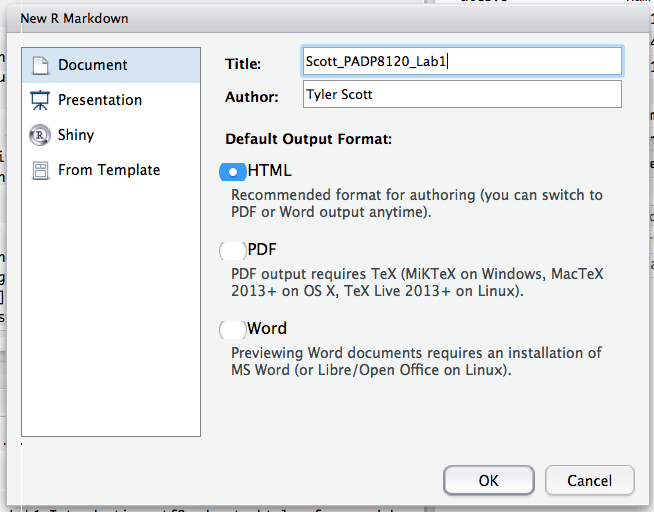
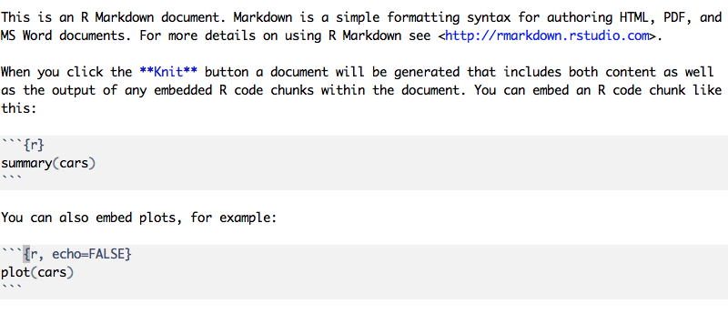

#Goals:

After this lab you will be able to:
 - Perform basic operations using R from RStudio
 - Load data into R
 - Produce an R Markdoiwn report

## 

This lab is adapted from materials by:

- Open Intro

## Introduction

The goal of today's lab is to introduce you to R, RStudio, and R Markdown. To straighten out which is which: R is the name of the programming language itself, RStudio is a convenient interface for working, in R, and R Markdown is "an authoring format that enables easy creation of dynamic documents, presentations, and reports from R" (http://rmarkdown.rstudio.com/). 

Labs and assignments in this course will use R and various add-ons to R; the goal is that by the end of the semester you will be able to conduct your own data analysis and research in R. Why R? In the end, R is just one tool among many (including SPSS, SAS, Julia, python, Stata, Matlab, or even Excel and Google Sheets) that are useful for data and statistical analysis. However, R is a particularly popular tool that you will (in most cases at least) not outgrow as you move towards more advanced methods and original research. In other words, it is easy to use R both for simple statistical applications such as linear regression and advanced tasks such as machine learning. In any case, I am very confident that mastering one programming language will provide great facility in learning other languages should a different language prove necessary for your work in the future. 

As you will see in the coming weeks, there is a vast array of things you can accomplish with R -- in fact, I expect that each of you will likely uncover or discover something that I do not yet know, and I am very excited to learn from you as well! I would encourage you to explore beyond what the labs and homeworks dictate; a willingness to experiment will make you a much better programmer.  

Today we begin with the fundamental building blocks of R and R Studio: the interface, reading in data, and basic commands.


The panel in the upper right contains your *workspace* as well as a history of 
the commands that you've previously entered.  Any plots that you generate will 
show up in the panel in the lower right corner.

The panel on the left is where the action happens.  It's called the *console*. 
Everytime you launch RStudio, it will have the same text at the top of the 
console telling you the version of R that you're running.  Below that information
is the *prompt*.  As its name suggests, this prompt is really a request, a 
request for a command.  Initially, interacting with R is all about typing commands
and interpreting the output. These commands and their syntax have evolved over
decades (literally) and now provide what many users feel is a fairly natural way
to access data and organize, describe, and invoke statistical computations.

While you can easily run code in the console, R also provides a way for you to save your code and related documents just as you would a Word document. By clicking on the paper with a green and white "+" symbol in the upper lefthand corner of your RStudio interface, you will open a new "script" file. A "Script" is simply a term for a document of R code. Script files have an .R suffix. You should ALWAYS work in script files so that you can readily edit and save your work. Further, as you advance you will learn how to make script files and then run entire scripts from the command line without opening R. 

To get started, open a new script file and then click on the disk symbol at the top left. This will open up a standard file-saving interface. Save this script file (e.g., LastName_PADP8120_Lab1) somewhere where you won't lose it. 

Next, insert the following code into your script file. You can either type it in manually or copy and paste it from this document. Then, "run" the code either by: (A) highlighting it; or (B) placing your cursor in the same line; and then (C) hitting cntrl-Enter (on a Mac) or contrl-R (on a PC). 

```{r load-abrbuthnot-data, eval=TRUE}
source("http://www.openintro.org/stat/data/arbuthnot.R")
```

This command instructs R to access the OpenIntro website and fetch some data: 
the Arbuthnot baptism counts for boys and girls. You should see that the 
workspace area in the upper righthand corner of the RStudio window now lists a 
data set called `arbuthnot` that has 82 observations on 3 variables. As you 
interact with R, you will create a series of objects. Sometimes you load them as
we have done here, and sometimes you create them yourself as the byproduct of a 
computation or some analysis you have performed. Note that because you are 
accessing data from the web, this command (and the entire assignment) will work 
in a computer lab, in the library, or in your dorm room; anywhere you have 
access to the Internet.


## Fundamentals of the R language

R is **object-oriented**.

**Objects are R's nouns**. They include (not exhaustive):

- character string (e.g. words)

- number

- vector of numbers or character strings

- matrix

- data frame

- list

##R Basics

At the very minimum, you can use R as a fancy calculator. For instance, the following running the following code works just as if you entered it into your old Ti-83+: 

```{r fancy-calculator, eval=FALSE}
6 + (3*6)
```

However, unlike your calculator, R uses object-oriented programming. From Wikipedia, object-oriented programming is based "on the concept of `objects`, which are data structures that contain data, in the form of fields, often known as attributes." In practice, what this means is that you can use names and labels to represent vectors of data or more complex objects such as models or datasets. For instance:

```{r fancy-calculator2, eval=FALSE}
b <- 6
b + 3*b
```

will compute the same value as the previous code chunk, because in your R session you have set the object "b" to represent a numerical value of 6. This might seem relatively trivial, but it has important and powerful implications. For instance, let's say you have a vector of 7 different values. You could designate b as a vector of those 7 values

```{r fancy-calculator3, eval=FALSE}
b = c(1,4,5,67,12,42,13)
```

and then run an operation on all 7 at the same time, even saving the output vector as a new object, "result":

```{r fancy-calculator4, eval=TRUE}
b = c(1,4,5,67,12,42,13)
result = b / 2
```


## Naming objects

- Object names **cannot have spaces**

    + Use `CamelCase`, `name_underscore`, or `name.period`

- Avoid creating an object with the same name as a function (e.g. `c` and `t`) or
special value (`NA`, `NULL`, `TRUE`, `FALSE`).

- Use **descriptive object names**!

    + Not: `obj1`, `obj2`

- Each object name must be **unique** in an environment.

    + Assigning something to an object name that is already in use will **overwrite
    the object's previous contents**.

Because we assigned the name *result*, if you type in "result", you should see the following:

```{r fancy-calculator5, eval=TRUE}
result
```

You probably noticed that we used the syntax c() to group the vector of 7 values together. C is a function that concatenates a series of objects into one object. The following code produces to vectors of numbers, and then concatenates the two vectors into one object (vector3): 

```{r fancy-calculator6, eval=TRUE}
vector1 = c(1,2)
vector2 = c(3,4)
vector3 = c(vector1,vector2)
vector3
```

1. Generate an object that contains 5 different numbers. Then, generate a second object that contains the product of your original object and 2 (i.e., multiply your first object by 2).

R can store characters as well as numbers. For instance, you can designate a list of names:

```{r characters, eval=TRUE}
names = c("Oscar","Gonzo","Telly","Kermit","Count")
```

Then, if you enter the object name, R will print out the vector of names you made:
```{r print-characters, eval=TRUE}
names
```


## Data structures in R

1. **Vector:** homogeneous groups of integers, numerics, logicals, characters.
Scalars are just vectors of length one.

2. **Matrix:** vectors with an additional dimension attributes (also homogeneous).

3. **Dataframe:** matrix of heterogeneous columns of the same length.


## Dataframe: nc

```{r}
#download.file("http://www.openintro.org/stat/data/nc.RData", destfile = "nc.RData")
#load("nc.RData")
nc <- read.csv('input/nc.csv')
```

- What are the dimensions?
- What mode of data is in each column? (`head()`)

## Vector Indexing

Consider the vector `x <- c(12,15,8,11,24)`.  How do we create a vector of the
differences between adjacent elements?

```{r}
x <- c(12, 15, 8, 11, 24)
x[-1] - x[-length(x)]
```

Work in vectors instead of loops where possible.


## Matrix Indexing

Square brackets again, but with [rows, columns].

```{r}
m = matrix(seq(1,16,1),ncol=4)
m[2, 3]
m[2, 2:4]
m[, 3]
```


Leaving a blank means "all".


# Taking R for a test drive

##

The Arbuthnot data set refers to Dr. John Arbuthnot, an 18<sup>th</sup> century 
physician, writer, and mathematician.  He was interested in the ratio of newborn
boys to newborn girls, so he gathered the baptism records for children born in
London for every year from 1629 to 1710.  We can take a look at the data by 
typing its name into the console.

```{r view-data, eval=FALSE}
arbuthnot
```

What you should see are four columns of numbers, each row representing a 
different year: the first entry in each row is simply the row number (an index 
we can use to access the data from individual years if we want), the second is 
the year, and the third and fourth are the numbers of boys and girls baptized 
that year, respectively. Use the scrollbar on the right side of the console 
window to examine the complete data set.

Note that the row numbers in the first column are not part of Arbuthnot's data. 
R adds them as part of its printout to help you make visual comparisons. You can
think of them as the index that you see on the left side of a spreadsheet. In 
fact, the comparison to a spreadsheet will generally be helpful. R has stored 
Arbuthnot's data in a kind of spreadsheet or table called a *data frame*.

You can see the dimensions of this data frame by typing:

```{r dim-data, eval=TRUE}
dim(arbuthnot)
```

This command should output `[1] 82 3`, indicating that there are 82 rows and 3 
columns (we'll get to what the `[1]` means in a bit), just as it says next to 
the object in your workspace. You can see the names of these columns (or 
variables) by typing:

```{r names-data, eval=TRUE}
names(arbuthnot)
```

You should see that the data frame contains the columns `year`,  `boys`, and 
`girls`. At this point, you might notice that many of the commands in R look a 
lot like functions from math class; that is, invoking R commands means supplying
a function with some number of arguments. The `dim` and `names` commands, for 
example, each took a single argument, the name of a data frame. 

One advantage of RStudio is that it comes with a built-in data viewer. Click on
the name `arbuthnot` in the *Environment* pane (upper right window) that lists 
the objects in your workspace. This will bring up an alternative display of the 
data set in the *Data Viewer* (upper left window). You can close the data viewer
by clicking on the *x* in the upper lefthand corner.

Let's start to examine the data a little more closely. We can access the data in
a single column of a data frame separately using a command like

```{r view-boys, eval=FALSE}
arbuthnot$boys
```

This command will only show the number of boys baptized each year.

2.  What command would you use to extract just the counts of girls baptized? Try
    it!

Notice that the way R has printed these data is different. When we looked at the
complete data frame, we saw 82 rows, one on each line of the display. These data
are no longer structured in a table with other variables, so they are displayed 
one right after another. Objects that print out in this way are called *vectors*;
they represent a set of numbers. R has added numbers in [brackets] along the 
left side of the printout to indicate locations within the vector. For example,
`5218` follows `[1]`, indicating that `5218` is the first entry in the vector. 
And if `[43]` starts a line, then that would mean the first number on that line
would represent the 43<sup>rd</sup> entry in the vector.

One important thing to keep in mind when using R is that it there are often several different ways to accomplish the same thing (or something that appears to be the same but has slightly different implications). For instance, the following lines of code will both also show the number of boys in each year.

```{r view-boys-alternate, eval=FALSE}
arbuthnot['boys']
arbuthnot[,2]
```

Often, it does not matter which coding method you use, but sometimes a particular way of doing a coding task can make a given operation much easier. You should feel free to experiment and try different ways of doing things; often, you will find an easier/neater/faster approach! What is different about this code? (hint: try using the *class* function on both lines of code)

```{r view-boys-class, eval=FALSE}
class(arbuthnot$boys)
class(arbuthnot['boys'])
class(arbuthnot[,2])
```

R has some powerful functions for making graphics. We can create a simple plot 
of the number of girls baptized per year with the command

```{r plot-girls-vs-year, eval=FALSE}
plot(x = arbuthnot$year, y = arbuthnot$girls)
```

By default, R creates a scatterplot with each x,y pair indicated by an open 
circle. The plot itself should appear under the *Plots* tab of the lower right 
panel of RStudio. Notice that the command above again looks like a function, 
this time with two arguments separated by a comma.  The first argument in the 
plot function specifies the variable for the x-axis and the second for the y-axis.
If we wanted to connect the data points with lines, we could add a third argument,
the letter `l` for **l**ine.

```{r plot-girls-vs-year-line, eval=FALSE}
plot(x = arbuthnot$year, y = arbuthnot$girls, type = "l")
```

You might wonder how you are supposed to know that it was possible to add that 
third argument.  Thankfully, R documents all of its functions extensively. To 
read what a function does and learn the arguments that are available to you, 
just type in a question mark followed by the name of the function that you're 
interested in. Try the following.

```{r plot-help, eval=FALSE, tidy = FALSE}
?plot
```

Notice that the help file replaces the plot  in the lower right panel. You can 
toggle between plots and help files using the tabs at the top of that panel.

3. Modify the above code with the help of the plot function helpfile to: (1) change the line to a dashed line; (2) increase the width of the line; and (3) change the color of the line. Next, try to change the line graph to a histogram. 

Now, suppose we want to plot the total number of baptisms.  To compute this, we 
could use the fact that R is really just a big calculator. We can type in 
mathematical expressions like

```{r calc-total-bapt-numbers, eval=FALSE}
5218 + 4683
```

to see the total number of baptisms in 1629. We could repeat this once for each 
year, but there is a faster way. If we add the vector for baptisms for boys and
girls, R will compute all sums simultaneously.

```{r calc-total-bapt-vars, eval=FALSE}
arbuthnot$boys + arbuthnot$girls
```

What you will see are 82 numbers (in that packed display, because we aren't 
looking at a data frame here), each one representing the sum we're after. Take a
look at a few of them and verify that they are right. You can also name new objects that represent values. The following code generates a new "object", boy_baptisms, that contains the record of boy baptisms.

```{r new-vector, eval=FALSE}
boy_baptisms = arbuthnot$boys
```

Now, if you enter the following code, you will see a vector of boy baptisms. 
```{r print-new-vector, eval=FALSE}
boy_baptisms
```

We can make a plot of the total number of baptisms per year with the command

```{r plot-total-vs-year, eval=FALSE}
plot(arbuthnot$year, arbuthnot$boys + arbuthnot$girls, type = "l")
```

This time, note that we left out the names of the first two arguments.  We can 
do this because the help file shows that the default for `plot` is for the first
argument to be the x-variable and the second argument to be the y-variable.

Similarly to how we computed the proportion of boys, we can compute the ratio of
the number of boys to the number of girls baptized in 1629 with

```{r calc-prop-boys-to-girls-numbers, eval=FALSE}
5218 / 4683
```

or we can act on the complete vectors with the expression

```{r calc-prop-boys-to-girls-vars, eval=FALSE}
arbuthnot$boys / arbuthnot$girls
```

The proportion of newborns that are boys

```{r calc-prop-boys-numbers, eval=FALSE}
5218 / (5218 + 4683)
```

or this may also be computed for all years simultaneously:

```{r calc-prop-boys-vars, eval=FALSE}
arbuthnot$boys / (arbuthnot$boys + arbuthnot$girls)
```

Note that with R as with your calculator, you need to be conscious of the order 
of operations.  Here, we want to divide the number of boys by the total number 
of newborns, so we have to use parentheses.  Without them, R will first do the 
division, then the addition, giving you something that is not a proportion.

R also has built in functions that apply basic mathematical operations to vectors. For instance: 

```{r sum-all-boys, eval=FALSE}
sum(arbuthnot$boys)
```

adds all boy baptisms together. Common functions you might use include sum, mean, median, min, and max. You can also use: 

```{r summary--boys, eval=FALSE}
summary(arbuthnot$boys)
```

to view several summary statistics at once. 

4. Calculate the minimum and maximum number of girls and boys born in a year in this dataset. 

5.  Now, make a plot of the proportion of boys over time. What do you see? Tip: 
If you use the up and down arrow keys, you can scroll through your previous 
commands, your so-called command history. You can also access it by clicking on 
the history tab in the upper right panel.  This will save you a lot of typing in
the future.

In addition to simple mathematical operators like subtraction and 
division, you can ask R to make comparisons like greater than, `>`, less than,
`<`, and equality, `==`. For example, we can ask if boys outnumber girls in each 
year with the expression

```{r boys-more-than-girls, eval=FALSE}
arbuthnot$boys > arbuthnot$girls
```

This command returns 82 values of either `TRUE` if that year had more boys than 
girls, or `FALSE` if that year did not (the answer may surprise you). This 
output shows a different kind of data than we have considered so far. In the 
`arbuthnot` data frame our values are numerical (the year, the number of boys 
and girls). Here, we've asked R to create *logical* data, data where the values
are either `TRUE` or `FALSE`. In general, data analysis will involve many 
different kinds of data types, and one reason for using R is that it is able to
represent and compute with many of them.

One important tip to remember is that R can treat logical values as numeric, with TRUE = 1 and FALSE = 0. Thus, you can easily identify the number of years in which the number of girl baptisms exceeds boy baptisms by using the following code:

```{r sum-girls-more-than-boys, eval=FALSE}
sum(arbuthnot$boys < arbuthnot$girls)
```

So far, you have learned about how to work with R using R Studio. For the next portion of the lab, you will learn how to make documents within R using R Markdown. 

## R Markdown

In this class, we will use R Markdown = R + Markdown. This is the format in which your homeworks MUST be turned in. 

#

#[Baumer et al (2014)](http://arxiv.org/abs/1402.1894)

R Markdown uses source - output paradigm (not WYSIWYG)

To begin using R Markdown, select the small dropdown arrow next to the "new script" button you used previously. Choose "R Markdown". If this option is not available, you need to install R Markdown by running the following code (install.packages is a function that you use to install R packages, which are collections of functions, data and compiled code in a well-defined format): 

```{r install-rmarkdown, eval=FALSE}
install.packages("rmarkdown")
```

Once you have chosen to open a new R Markdown file, in the interface that pops up title your new markdown document (e.g., "LastName_PADP8120_Lab1") and designate the type of markdown document that you want to produce. For now, choose html as the default output format, and Document as the new R Markdown deliverable to produce. Select OK. 



Your new markdown file will open up--you will notice that it contains a template that you can use as a guide for making your own .Rmd document. Notice that the file name is still "Untitled1"; the name you designated when you generated a new file is the title that will show up at the top of your markdown document, but it is not a formal file name. Click "save" and save/title your new file. The document you're looking at should look something like this:

***



***

Basically, R Markdown is intended to allow you to format content professionally without using HTML or LaTeX. The darker grey areas show code chunks; standard text is shown on the white background. When you click the **Knit** button a document will be generated that includes both content as well as the output of any embedded R code chunks within the document.

You can run lines of code within a code chunk just as you would from an R-script (e.g., Cntrl-Enter); this is a useful way to test code in your markdown document without compiling the whole think. The first line of the code chunk (started with the triple apostrophe) is used to specify options of the code chunk. Here are a few important options:

*eval: TRUE/FALSE, determines whether the code chunk is actually evaluated or not

*echo: TRUE/FALSE, whether to include source code in the output file

*warning: TRUE/FALSE, whether to output any warnings

*error: TRUE/FALSE, whether R markdown should stop on errors

*message: TRUE/FALSE, whether processing messages should be produced in output file

6. First, try compiling this sample document by clicking on "Knit HTML"; then, edit the second code chunk by setting echo=TRUE (it is initally set to echo=FALSE). Select Knit HTML again- what is different about the output file?

You can also embed code (or code output) inline (i.e., within text sections) in R Markdown. Type or paste the following text at the bottom of your document. 

```{r intext-sample, eval=FALSE}
I counted `r 1+1` sharks at the beach.
```

For inline R Code, the first apostrophe followed by the "r" starts the code snippet, telling R Markdown to evaluate whatever comes next as an R command rather than as text. The second apostrophe ends the code snippet. Thus, R Markdown will run 2+2 in R and output the result where you set the code snippet. 

7. Write your own code snippet that outputs the mean of 3, 10, and 31. Here is the R code for computing the mean:

```{r mean, eval=FALSE}
mean(c(3,10,31))
```
use a code snippet so that the value is inserted into the following sentence:

'The mean of 3, 10, and 31 is...'  Now, use the round() function to ouput the mean rounded to 1 digit (use ?round if you are stuck and need help). 

You can also embed equations in an R markdown document. The dollar sign symbol is used to produce in in-line equation:

```{r mean-inline, eval=FALSE}
The Arithmetic mean is equal to $\frac{1}{n} \sum_{i=1}^{n} x_{i}$. 
```

Two dollar signs are used to make a formal equation:

```{r mean-formal, eval=FALSE}
$$\frac{1}{n} \sum_{i=1}^{n} x_{i}$$
```

8. Using the above code, produce a sentence in your markdown document that incorporates the mean formula in-line. 

9. Generate a formal arithmetic mean equation in your document. 

##Loading data into R

R is great, but without data there's only so much you can do! There are LOTS of different ways to load data into R. Broadly, the two questions you must ask when loading data are:

I. Where are the data stored?

II. What format are the data in?

For the most part, these questions will be fairly easy to address for labs and homeworks in this course. As we are not going to get into machine learning, web scraping, or similar things in this course, for the most part you will be asked to read in data that exist in a file, either remotely (e.g., a website such as github) or locally (i.e., stored on your computer). 

###Loading text files

Many datasets exist in a text file format, such as a csv (comma separated value) file. In a csv file, the comma (,) is the delimeter. Plain text files (.txt files) are tab delimited. You can load a csv file using the `read.csv` function:

```{r eval=FALSE}
read.csv('//Directory/To/File/myfile.csv')
```

The file name can either be a character string specifying the location of the file on your local computer, or a url specifying the location of a file stored on the internet:

```{r eval=FALSE}
read.csv('url.for.myfile.csv')
```

To practice, we will work with some of the data from the Gapminder project. Here is an excerpt prepared for your use. Please save this file locally, for example, in the directory associated with your RStudio Project:

`http://www.stat.ubc.ca/~jenny/notOcto/STAT545A/examples/gapminder/data/gapminderDataFiveYear.txt`

You should now have a plain text file called gapminderDataFiveYear.txt on your computer, in your working directory. Do this to confirm:

```{r eval=FALSE}
list.files()
```

You should see `gapminderDataFiveYear.txt` in the console output when you run the `list.files()` command. One way to read in this local file is the `read.delim()` function. R is pretty good at guessing, so it does not need you to specify the delimiter in this case:

```{r echo=F,warning=F,message=F}
gapminderData = read.delim('http://www.stat.ubc.ca/~jenny/notOcto/STAT545A/examples/gapminder/data/gapminderDataFiveYear.txt')
```

```{r eval=FALSE}
gapminderData <- read.delim('gapminderDataFiveYear.txt')
```

```{r}
head(gapminderData)
```

You could also use the `read.table()` function, but in this case you would need to specify the delimiter (try without doing so and see if you getn in error term). In this case, we also need to tell R that the first row in the file holds columns names; try setting `header=F` and see what the file looks like.

```{r eval=FALSE}
gapminderData <- read.table('gapminderDataFiveYear.txt',sep='\t',header=T)
```

```{r}
head(gapminderData)
```

CSV files (.csv) can be read in the same way:

```{r eval=FALSE}
gapminderData <- read.csv('gapminderDataFiveYear.csv',header=T)
```

10. Try reading the .txt file directly from the url link provided above using `read.delim()`. Can you find a link on the course github page and read the file in that way? 

Reading .xls, .xlsx, and .gsheet (Google sheet files) can sometimes be more difficult, but is also very doable. R does not have native support for excel files, but there are several packages that make things very easy. Install and load the `gdata` package, which contains a `read.xls` function:

```{r eval=FALSE}
library(gdata)
gapminderData <- read.xls('gapminderDataFiveYear.xls')
```

Reading a Google sheet can be more difficult, but we will try that later in the semester. 

The `foreign` package will also be a good friend to you. This package has functions such as `read.data()` (for Stata files), `read.dbf()` (not quite sure what dbf files really are, but programs such as ArcGIS will often output tables as dbf dataframes), and `read.spss()` (you guessed it, SPSS files). 

```{r eval=FALSE}
library(foreign)
```

Previously, you recreated some of the displays and preliminary 
analysis of Arbuthnot's baptism data. Repeat these steps, but for present day birth records in the United States.  Load up the present day data with the following command.

```{r load-present-data, eval=FALSE}
source("http://www.openintro.org/stat/data/present.R")
```

The data are stored in a data frame called `present`.

11. What years are included in this data set? What are the dimensions of the 
    data frame and what are the variable or column names?

12. How do these counts compare to Arbuthnot's? Are they on a similar scale?

13. Make a plot that displays the boy-to-girl ratio for every year in the data 
    set. What do you see? Does Arbuthnot's observation about boys being born in
    greater proportion than girls hold up in the U.S.? Include the plot in your 
    response.

14. In what year did we see the most total number of births in the U.S.? You can
    refer to the help files or the R reference card 
    [http://cran.r-project.org/doc/contrib/Short-refcard.pdf](http://cran.r-project.org/doc/contrib/Short-refcard.pdf)
    to find helpful commands.

These data come from a report by the Centers for Disease Control 
[http://www.cdc.gov/nchs/data/nvsr/nvsr53/nvsr53_20.pdf](http://www.cdc.gov/nchs/data/nvsr/nvsr53/nvsr53_20.pdf). 


That was a short introduction to R, RStudio, and R Markdown, but we will provide you with more functions and a more complete sense of the language as the course progresses. To exit RStudio you can click the *x* in the upper right corner of the whole window.  You will be prompted to save your workspace. If you click *save*, RStudio will save the history of your commands and all the objects in your workspace as an .RData file so that the next time you launch RStudio, you will see `arbuthnot` and you will have access to the commands you typed in your previous session.

