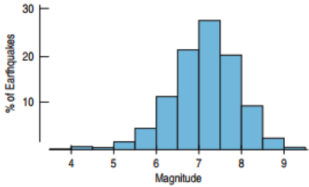
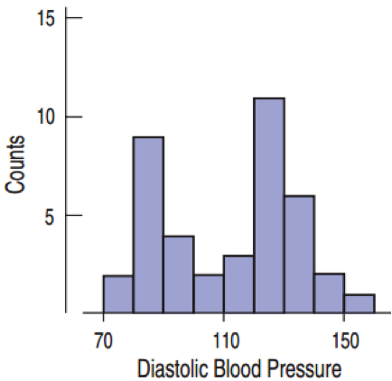
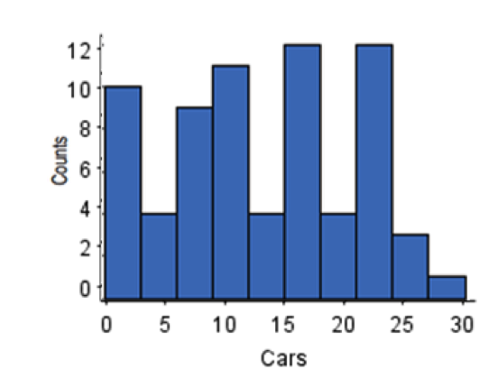
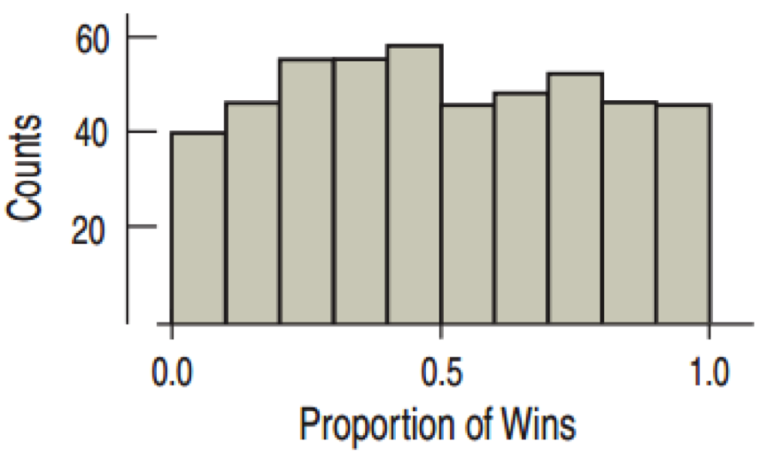
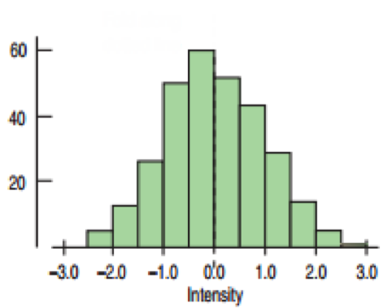
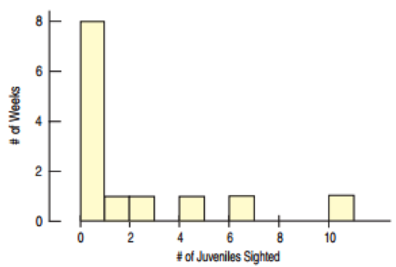
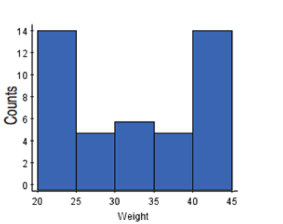
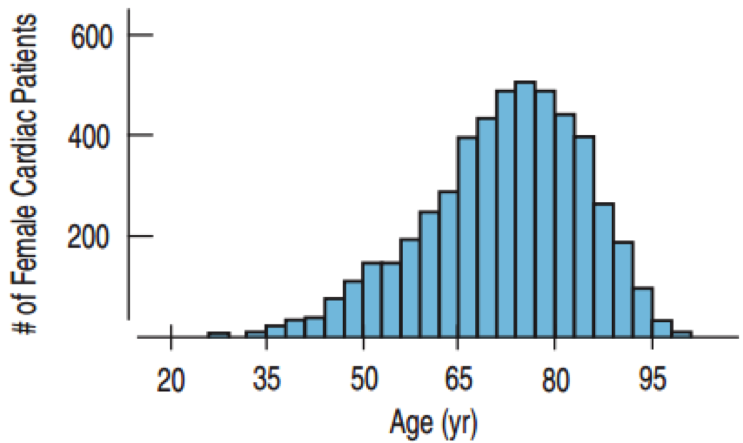
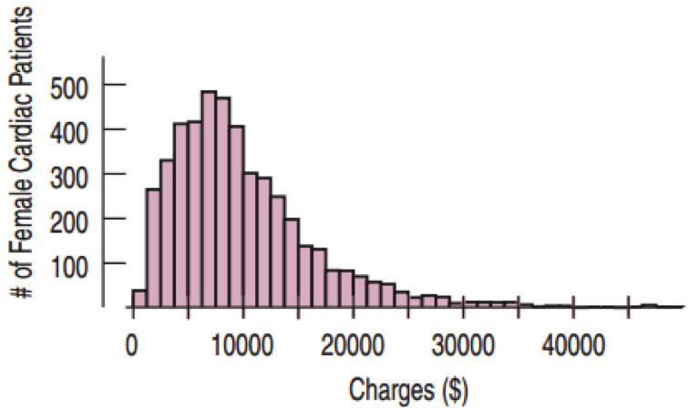

---
title: "PADP_8120_Lab6: Significance"
author: "Tyler Scott"
date: "2015-08-11 " 
output:
  html_document:
    highlight: pygments
    theme: cerulean
widgets     : [mathjax]            # {mathjax, quiz, bootstrap}
---

## Lab Topics


- P-value calculation in R
- Confidence intervals in R
- Extra topic: Transformations in R

##Goals:

After this lab you will be able to:
- Compute confidence intervals in R
- Compute p-values
- Transform data

## 

This lab is adapted from materials by:

- Andrew Poje (http://www.math.csi.cuny.edu/~poje/Teach/)
- Andrew Bray and Mine Cetinkaya-Rundel 
- Christopher Gandrud

# Normal probabilities (i.e., p-values)

In Lab 4, we used a body measurement dataset obtained from the folks at OpenIntro. Let's return to that dataset this week. Recall that this data set contains measurements from 247 men and 260 women, most of whom were considered healthy young adults.

```{r load-data, eval=TRUE,echo=FALSE,message=FALSE}
load("input/bdims.RData")
```

Let's take a quick peek at the first few rows of the data.

```{r head-data, eval=TRUE,echo=FALSE,message=FALSE}
mdims <- subset(bdims, sex == 1) #subset male-only dataframe
fdims <- subset(bdims, sex == 0) #subset female-only dataframe
fhgtmean <- mean(fdims$hgt) #mean female height
fhgtsd   <- sd(fdims$hgt) #female height standard deviation
```

In Lab 4, we established that height for males and females (respectively are approximately normally distributed. Once we decide that a random variable is approximately normal, we can answer all sorts of questions about that variable related to probability. For example, the question of, "What is the probability that a randomly chosen young adult female is taller than 6 feet (about 182 cm)?" If we assume that female heights are normally distributed (a very close approximation is also okay), we can find this probability by calculating a Z (or t) score and consulting a Z (or t) table (also called a normal probability table).  In R, this is done in one step with the function `pnorm`.

```{r pnorm, eval=FALSE}
1 - pnorm(q = 182, mean = fhgtmean, sd = fhgtsd)
```

The function `pnorm` gives the area under the normal curve below a 
given value, `q`, with a given mean and standard deviation.  Since we're 
interested in the probability that someone is taller than 182 cm, we have to 
take one minus that probability. Alternatively, we could invert the `pnorm` function by setting `lower.tail=FALSE` within the call, which produces the same value (The big takeway here is to always pay close attention to which tail you are calculating!). 

```{r eval=FALSE}
pnorm(q = 182, mean = fhgtmean, sd = fhgtsd, lower.tail=F)
```

Assuming a normal distribution has allowed us to calculate a theoretical probability.  If we want to calculate the probability empirically, we simply need to determine how many observations fall above 182 then divide this number by the total sample size.

```{r probability, eval=FALSE}
sum(fdims$hgt > 182) / length(fdims$hgt)
```

Although the probabilities are not exactly the same, they are reasonably close. 
The closer that your distribution is to being normal, the more accurate the theoretical probabilities will be.

1.  Write out two probability questions that you would like to answer; one regarding female heights and one regarding female weights.  Calculate the those probabilities using both the theoretical normal distribution as well as the empirical distribution (four probabilities in all).  Which variable, height or weight, had a closer agreement between the two methods?

I'll choose two examples:
 
Example 1: What is the probability that a randomly chosen female is less than 6ft tall?
 
```{r}
pnorm(q = 182, mean = fhgtmean, sd = fhgtsd, lower.tail=T)
sum(fdims$hgt < 182) / length(fdims$hgt)
```

Here, the values are pretty close. Basically, either way we conclude that there is about a 99.5% chance that a randomly chosen female will be less than 6ft tall. 

Example 2: What is the probability that a randomly chosen female weighs less than 100 pounds? (note that wt is in kg, so we'll approximate and multiply by 2.2 to get lbs)

```{r}
fwtmean = mean(bdims$wgt[bdims$sex==0]*2.2)
fwtsd = sd(bdims$wgt[bdims$sex==0]*2.2)
pnorm(q = 100, mean = fwtmean, sd = fwtsd, lower.tail=T)
sum((bdims$wgt[bdims$sex==0]*2.2) < 100) / length(bdims$wgt[bdims$sex==0])
```

Here, we don't get very good agreement. The distribution-based method estimates the probability of a female weighing less than 100lbs at about 0.058, whereas the observed-data method estimates the probability to be 0.015.

Height thus seems to have better agreement between the two methods. 


## R and probability

So far, we have only used the `pnorm` function. R actually has a set of functions for every distribution that perform various operations. The family of functions for the normal distribution is:

`dnorm`: density function (height of distribution for a given x value)
`pnorm`: distribution function (proportion of distribution expected to be beyond critical value)
`qnorm`: quantile function (quantile value for given probability)
`rnorm`: generate random deviates (random number from normal distribution with mean = a, sd = sd(a))

It can take a bit of practice to get used to working with these (and I still end up using the help file from time to time), but let's walk through each one:

### dnorm

`dnorm` computes the height of the probability density function at a given x value. The easiest way to understand how `dnorm` works is to use it to plot a pdf. Recall that the mean of `fght` `r fhgtmean` and the standard deviation is `r fhgtsd`. If the mean is `r fhgtmean` and we are talking about a normal distribution, where should the highest point of the pdf be?

To test this, let's compute the `dnorm` value for a ranges of x values between 0 and 200 and plot them against a 1 to 200 vector:

```{r eval=FALSE}
plot(x=1:200,y = dnorm(1:200, mean = fhgtmean, sd = fhgtsd))
```

Is this what you might have predicted? What if we increase the standard deviation?

```{r eval=FALSE}
plot(x=1:200,y = dnorm(1:200, mean = fhgtmean, sd = fhgtsd+10))
```

If you change the mean, the plot will center on the new mean:

```{r eval=FALSE}
plot(x=1:200,y = dnorm(1:200, mean = 75, sd = fhgtsd+10))
```

### pnorm

We already saw a little about what`pnorm` can do. Above, we found that the proportion of the theoretical distribution beyond the observed value was `r pnorm(182, mean=fhgtmean,sd=fhgtsd,lower.tail=F)`. If we again plot the probability density function, we can visualize what `pnorm` is doing by plotting a vertical line with an x-intercept equal to the test value (182):

```{r eval=FALSE}
plot(x=130:190,y = dnorm(130:190, mean = fhgtmean, sd = fhgtsd),type='l')
abline(v=182,lty=2,col='red')
```

As we calculated, only a very tiny proportion of the distribution is expected to lie beyond 182. If you do not specify a mean and standard deviation, R will assume that $\mu = 0, sd = 1$. 

### qnorm

`qnorm` is used to calculate the critical value itself (i.e., the quantile). This essentially works inversely to `pnorm`, since `pnorm` calculates the probability density beyond a critical value and `qnorm` calculates the critical value for a given probability. To show this, let's specify `v` to be equal to the result of the `pnorm` call we used above:

```{r eval=FALSE}
v = pnorm(q = 182, mean = fhgtmean, sd = fhgtsd,lower.tail=F)
v
```

Then, let's use `qnorm` to call the quantile value where the total proportion of the distribution equals `v`. It should produce the original value we plugged in to `pnorm`, 182:

```{r eval=FALSE}
qnorm(v, mean=fhgtmean,sd=fhgtsd)
```

WHAY DOESN'T THIS WORK? Remember, we have to be careful to determine which tail R is giving us. `qnorm` also hase a  `lower.tail` setting, so let's again set `lower.tail=FALSE` so that we get the quantile value for which the proportion beyond (to the right) of the p-value we specify into `qnorm`:

```{r eval=FALSE}
qnorm(v, mean=fhgtmean,sd=fhgtsd,lower.tail=FALSE)
```

Now we're good to go (as long as you get 182 from the call above...)!

### rnorm

Last but not least, rnorm will generate random values from the distribution we specify. This can be incredibly useful for simulations, producing sample data, and many other applications. To generate a random real value from the standard normal distribution ($\mu = 0, sd = 1$), you can simply use:

```{r eval=FALSE}
rnorm(1)
```

For our ongoing example, we can call:

```{r eval=FALSE}
rnorm(1,sd=fhgtsd,mean=fhgtmean)
```

to generate one random value or:

```{r eval=FALSE}
rnorm(10,sd=fhgtsd,mean=fhgtmean)
```

to generate 10. If we generate enough values, we should approximate the distribution we fed into `rnorm`. 

2. Repeat the commands shown above, but this time to answer the quesiont, "What is the probability that a randomly chosen young adult male is taller than 5'6" (about 167 cm)?"

```{r}
mhgtmean <- mean(mdims$hgt) #mean male height
mhgtsd   <- sd(mdims$hgt) #male height standard deviation
pnorm(167,mean=mhgtmean,mhgtsd,lower.tail=FALSE)
```

We find that there the probability that a randomly selected adult male is taller than 167cm is about 0.93. 

3. Use `rnorm` to simulate a vector of random values from the male height distribution you specify. About how many random numbers do you need to generate before the density plot begins to look "normal"? (use `densityplot` from the `lattice` package for an easy way to plot the density of simulated values)

```{r eval=FALSE}
library(lattice)
densityplot(rnorm(100,sd=fhgtsd,mean=fhgtmean))
```

```{r message = FALSE}
library(lattice)
densityplot(rnorm(10,mean=mhgtmean,sd=mhgtsd))
```

10 draws doesn't look very good...

```{r message = FALSE}
densityplot(rnorm(50,mean=mhgtmean,sd=mhgtsd))
```

50 is better...

```{r message = FALSE}
densityplot(rnorm(500,mean=mhgtmean,sd=mhgtsd))
```

500 is even better...

```{r message = FALSE}
densityplot(rnorm(500,mean=mhgtmean,sd=mhgtsd))
```

and when we draw a TON of samples, it's looks (as it should) like a normal distribution:

```{r message = FALSE}
densityplot(rnorm(10000,mean=mhgtmean,sd=mhgtsd))
```


## Other distributions

You are not limited to using the "norm" family. In fact, for basically any distribution you can think of, R has the corresponding p/d/q/r functionality. For instance:

```{r eval=FALSE}
pt()
dt()
qt()
rt()
```

perform the exact same operations, but for the *t* distribution. However, since the *t*-distribution is conditional on the number of degrees of freedom, you also need to specify `df = x`. Note however, that R's *t*-distribution functions do not allow you to specify a distribution that is not centered at zero. 

Another common set is the **unif* family, which all refer to a uniform distribution. 

```{r eval=FALSE}
punif()
dunif()
qunif()
runif()
```

4. Use the `runif()` function to generate a vector of 1000 randomly drawn values from a uniform distribution between 0 and 100.

```{r}
runif.sample <- runif(1000,0,100)
str(runif.sample)
```

5. What is the expected value of this sample mean? Why? 

As you might "expect", E(x) = (0+100)/2 = 50. Basically, in a uniform distribution, every value has an equal chance of being drawn. Thus, our "best guess" for a given draw is exactly in the middle of the range, since we have no basis for guessing whether a random draw is likely to be above or below this point. 

6. Calculate the sample mean

```{r}
mean(runif.sample)
```

Almost 50 as we expect.

# Confidence Intervals

Lets look at confidence intervals and hypothesis tests using some ‘real’ data. Actually, we can simulate some data and then use R to take samples, compute means and standard deviations, etc. Let’s reconsider a question concerning the amount of soda in some soda bottles. The Coke Bottling Plant in Atlanta produces a huge number of half gallon, plastic Diet Coke bottles. The company claims that, due to manufacturing upgrades, the amount of in each bottle they ship has a mean of volume of 64.00 ounces and is exponentially distributed. 

Now suppose we had ALL the data on Coke's Atlanta soda bottles. This is the same as assuming we know everything about the population. We will use R to simulate a population of amounts of soda in 10,000 soda bottles. We assume an exponential population distribution function and randomly create 10,000 pieces of data in a variable called `pop`. DO NOT WORRY about the mechanics of the first line of good; suffice to say, it generates an exponential distribution of values with a maximum of 65 ounces and a left-hand tail that decreases exponentially such that most values are very near the mean of 64. In an unaltered exponential distribution, the mean = sd; note that in the code below, we subtract the randomly generated values from 65, so the mean of `pop` will not equal the standard deviation. 

```{r eval=TRUE,echo=FALSE}
pop = 65 - rexp(100000,0.65);
hist(pop)
```

In case you want proof regarding the mean = sd thing, you'll see that `mean(65-pop)` basically equals `sd(pop)`

```{r}
mean(pop)
mean(65 - pop)
sd(pop)
```

7. What does the histogram says about the data. 

As stated above, we see a skewed distribution with most values near 64, no values above 65, and a few values trickling off as we get below 60. 

8. Based upon the "observed" population data (the data you just simulated) what are the chances of finding a soda bottle with less than 64 oz in it? What about more than 64 oz?

Since we are assuming that the data we just simulated are the population data, we simply need to compute the proportion of bottles above and below 64 ounces:
```{r}
sum(pop>64)/length(pop)
sum(pop<64)/length(pop)
```

As should be expected that we simulated the data based upon an assumed mean of 64, there is basically a 0.5 probability of being above or below 64 ounces.

9. Make a boxplot of the data. Is it what you expect? Why?

```{r}
boxplot(pop)
```

The boxplot demonstrates the skewed nature of the distribution; the mean (shown by the solid black horizontal line) is at 64, but there are many outliers on the lower end. 

10. Find the population mean and standard deviation.

```{r}
mean(pop)
sd(pop)
```

Recall that the Central Limit Theorem says that no matter what the shape of the population distribution, the shape of the
distribution of sample means (for large enough sample size) is approximately normal. Suppose we take many samples of size n = 40. 

The janky way to do this is with this code:

```{r eval=FALSE}
sampmeans <- numeric(0)
for (i in 1:500) sampmeans[i] = mean(sample(pop,40, rep=T))
```

11. Use a function to preform this same operation in vectorwise fashion (i.e., do this without using a loop!)

```{r echo=FALSE,results='hide'}
sampmeans = replicate(500,mean(sample(pop,40,rep=T)))
```

```{r eval=FALSE}
hist(sampmeans)
```

We can visualize the sample mean distribution, but we might want to quantify how "normal" the distribution is. One way to quantify this is to make the ’normal probability’ plot. The basic idea is to plot the quantiles of your distribution against the quantiles of a truly normal distribution. If the plot is a straight line, then the data is distributed just like the normal data. This type of plot is also known as a "q-q" plot, which is short for "quantile vs. quantile" plot. 

```{r}
qqnorm(sampmeans) #Plot q-q points
qqline(sampmeans) #Add "perfect" line
```

12. What does the q-q plot tell us? 

In this case, we see the the sample mean distribution reasonably approximates a normal distribution. Things break down at the tails, particularly the upper tail, since we enver seem to get a sample mean ABOVE 64 but we get plenty below. 

13. Change the sample size and compare the qqnorm plots. Try sample sizes n = 64, n = 100 and n = 256.

```{r}
sampmeans64 = replicate(500,mean(sample(pop,64,rep=T)))
qqnorm(sampmeans64) #Plot q-q points
qqline(sampmeans64) 
```

```{r}
sampmeans100 = replicate(500,mean(sample(pop,100,rep=T)))
qqnorm(sampmeans100) #Plot q-q points
qqline(sampmeans100) 
```

```{r}
sampmeans256 = replicate(500,mean(sample(pop,256,rep=T)))
qqnorm(sampmeans256) #Plot q-q points
qqline(sampmeans256) 
```

14. What happens as the sample size increases? Why?

Generally, things get a little more "normal" because we are reducing sampling variation.


### Computing confidence intervals

We want to compute some Confidence Intervals from our samples. In this (artificial) case, we know the population parameters: $\mu$ (the population mean) and $\sigma$, the population standard deviation. Using a sample size of n = 40, take 50 such samples.

```{r eval=TRUE,results='hide'}
sampmeans2 = replicate(50,mean(sample(pop,40,rep=T)))
hist(sampmeans2)
```

Recall that the standard deviation of the sample mean is:

$$ \sigma_{\bar{x}} = \sigma / \sqrt(n) $$

16. Use this formula to calculate the SE for your sample mean distribution.

```{r echo=FALSE}
m = 50; n = 40; mu = mean(pop); sigma = sd(pop);
SE = sigma/sqrt(n) # Standard error in mean
```

If we pick a confidence interval, say $\alpha = 0.1$ ($90%$ confidence), we can compute a confidence interval for our measure of the population mean for each one of our samples. Let's compute and plot the confidence intervals for the 50 samples:

17. Use `qt` to find the appropriate critical value (don't forget that a CI is two-sided, so you need to split alpha in half...)

```{r ,echo=FALSE}
alpha = 0.10
tstar = 1-qt(alpha/2,df=50)
```

18. What does this plot represent?

```{r}
par(mfrow=c(1,1))
matplot(rbind(sampmeans2 - tstar*SE, sampmeans2 + tstar*SE),rbind(1:m,1:m), type="l", lty=1)
abline(v=mu)
```

The `sampmeans2` object contains the mean of 50 different samples. Thus, for each of these sample means, we subtract/add the product of the t-critical value and the standard error to get the confidence interval bounds.

19. How many of these 50 CIs would be expect to not contain the "true" value (shown by the solid black line) simply due to random sampling error? 

Recall that we computed 90% confidence intervals; this means that 9 times out of 10, we expect that our CI will contain the true population mean. Thus, since we took 50 samples, we'd expect that 5 times out of 50 the CI WILL NOT contain the true population mean simply due to random chance.

20. Change the sample size, n. Try n = 100 and n = 256.

  (a) Replot the 50 90% confidence intervals. How many of the 50 actually bracket the true mean?
  
```{r eval=TRUE}
n=100
sampmeans3 = replicate(50,mean(sample(pop,n,rep=T)))
m = 50; n = 40; mu = mean(pop); sigma = sd(pop);
SE = sigma/sqrt(n)
alpha = 0.10
tstar = 1-qt(alpha/2,df=50)

matplot(rbind(sampmeans3 - tstar*SE, sampmeans2 + tstar*SE),rbind(1:m,1:m), type="l", lty=1)
abline(v=mu)
```

```{r eval=TRUE}
n=256
sampmeans3 = replicate(50,mean(sample(pop,n,rep=T)))
m = 50; n = 40; mu = mean(pop); sigma = sd(pop);
SE = sigma/sqrt(n)
alpha = 0.10
tstar = 1-qt(alpha/2,df=50)

matplot(rbind(sampmeans3 - tstar*SE, sampmeans2 + tstar*SE),rbind(1:m,1:m), type="l", lty=1)
abline(v=mu)
```


  (b) Set the sample size to n = 40, but take 100 different samples and change the confidence interval size. For $alpha = 0.05$, make a plot of 100 confidence intervals. How many do expect will NOT bracket the true population mean? Is this what you see?
  
```{r eval=TRUE,results='hide'}
n=40
sampmeans3 = replicate(100,mean(sample(pop,n,rep=T)))
m = 100; n = 40; mu = mean(pop); sigma = sd(pop);
SE = sigma/sqrt(n)
alpha = 0.05
tstar = 1-qt(alpha/2,df=50)

matplot(rbind(sampmeans3 - tstar*SE, sampmeans3 + tstar*SE),rbind(1:m,1:m), type="l", lty=1)
abline(v=mu)
```

Since we ran 100 different sampling processes, we'd expect that 1 out of every 20 (or 5 total) CIs would not contain the population mean. 

# Transformations (extra topic)

It is preferable if the distribution of your data is symmetric. For example, if you have heavily skewed data, a histogram or a boxplot won’t be so informative. But not only for visualization, many models or parametric tests assume that the data are (at least approximately) normally distributed, and if your data is heavily skewed you are sure this assumption is violated. Hence, sometimes it is better to transform your data prior to analyzing it. 

**Note that linear transformations (of the form x → a + bx) do not change the shape of the distribution, so for this purpose
only non-linear transformations are useful.**

The three main objectives for transforming data are:

* Normalize the distribution: Many statistical models and parametric test assume that data is (approximately)
normal. Common transformations to get data closer to being normal are the logarithm transformation
and the inverse probability transformation

* Stabilize the variances: Besides normality, many parametric tests require equal variances of the data points
as well. A typical example of a variance stabilizing transformation is the square root transformation: $y -> \sqrt(Y)$

* Linearize the trend: Regression analysis techniques require the assumption of linearity. For non-linear data there exist non-linear regression approaches, but in many cases it is easier to apply a linearizing transformation. A typical example of such a re-expression is the logarithmic transformation.

```{r setup, echo=FALSE, results='hide',message=F}
require(ggplot2)
require(gdata)
library(knitr)
library(reshape2)
library(plyr); library(dplyr)
load('input/titanic.Rda')
movies <- read.csv('input/movie_lengths_2010.csv', stringsAsFactors=FALSE)
ozone <- read.csv('input/Ozone.csv', stringsAsFactors=FALSE)
ozone$Ozone <- as.numeric(ozone$Ozone)
ozone <- ozone[!is.na(ozone$Ozone),]

# See http://data.giss.nasa.gov/gistemp/tabledata_v3/GLB.Ts+dSST.txt
temp <- read.table('input/GlobalTemp.txt', header=TRUE, strip.white=TRUE)
temp$means <- rowMeans(aggregate(temp[,c("DJF","MAM","JJA","SON")], by=list(temp$Year), FUN="mean")[,2:5])
temp$meansF <- temp$means / 100 * 1.8

# temp2 <- melt(temp[,1:13], id='Year')
# temp2$value <- temp2$value / 100 * 1.8
# ggplot(temp2, aes(x=variable, y=value)) + geom_boxplot()

# World data
countries = read.csv('input/WDI_GDF_Country.csv', strip.white=TRUE)
worldData = read.csv('input/WDI_GDF_Data.csv', strip.white=TRUE)
worldData2 = worldData[which(worldData$Series.Code %in% c('NY.GDP.MKTP.KD', 'SE.XPD.TOTL.GD.ZS', 'SP.DYN.LE00.IN', 'SP.POP.TOTL')), c('Series.Code', 'Series.Name', 'Country.Name', 'Country.Code', 'X2008')]
worldData2 = merge(worldData2, countries[,c('Country.Code', 'Region')], by='Country.Code')
worldData2 = worldData2[which(worldData2$Region != 'Aggregates'),]
worldData2$Series.Name = as.factor(as.character(worldData2$Series.Name))
worldData2$Region = as.factor(as.character(worldData2$Region))

worldData2 = worldData2 %>% group_by(Country.Name,Region,Series.Name) %>% summarise(mean(X2008,na.rm=T))

worldData3 = dcast(worldData2,Country.Name + Region ~ Series.Name,mean,na.rm=T)

names(worldData3) = c('Country', 'Region', 'GDP', 'Life.Expectancy', 'Population', 'Education')
worldData3$GDP.log = log(worldData3$GDP)
worldData3$GDP = worldData3$GDP / 1000000000 #Billions
worldData3$Population = worldData3$Population / 1000000 #Millions

```

When evaluating whether or not you should transform data, histograms are an invaluable tool, so let's take a second and discuss them:


### Histograms


* First introduced by Karl Pearson, a histogram is a graphical representation of the distribution of data.
* The interval of data are divided into bins (on the x-axis) and the y-axis is simply a count of data points within that bin.
* As our example, let's use a database of movie run times from 2010. 

```{r results='hide',echo=FALSE}
movies <- read.csv('input/movie_lengths_2010.csv', stringsAsFactors=FALSE)
```


```{r, fig.width=6, fig.height=5,results='hide'}
hist(movies$Running.Time)
```

### Histograms (with ggplot2)

```{r, fig.width=10, fig.height=5,echo=FALSE,message=F}
ggplot(movies, aes(x=Running.Time)) + geom_histogram()
```


### Histograms (with ggplot2): Binwidths

* Different bin widths tell different stories.
* Choose the width that best shows the important features.
* Presentations can feature two histograms that present the same data in different ways.
* A gap in the histogram means that there were no occurrences in that range.

```{r, fig.width=5, fig.height=6, tidy=FALSE}
ggplot(movies, aes(x=Running.Time)) + 
  geom_histogram(binwidth=15)
```


### Modes

A Mode of a histogram is a hump or high-frequency bin.
* One mode → Unimodal
* Two modes → Bimodal
* 3 or more → Multimodal

<table border=0 width='100%'><tr><td>

</td><td>

</td><td>

</td></tr></table>


### Uniform Distributions

* Uniform Distribution: All the bins have the same frequency, or at least close to the same frequency.
* The histogram for a uniform distribution will be flat.

<center></center>


### Symmetry

The histogram for a symmetric distribution will look the same on the left and the right of its center.

<table border=0 width='100%'><tr><td>

</td><td>

</td><td>

</td></tr></table>

--- &twocol

### Skewness


A histogram is skewed left if the longer tail is on the left side of the mode.

Negatively Skewed




A histogram is skewed right if the longer tail is on the right side of the mode.

Positively Skewed



---


## Transforming Data

* When data is skewed it becomes difficult to interpret measures of center and spread.
* Transforming data is an approach to make skewed data more symmetric.

### Common Transformations

* Skewed Right: Use log, ln, or $\frac{1}{x}$
* Skewed Left: Use ${ x }^{ 2 }$


---

## Example: World GDP and Life Expectancy

```{r, warning=FALSE, fig.width=10, fig.height=5, message=FALSE,tidy=FALSE}
ggplot(worldData3, aes(x=GDP, y=Life.Expectancy)) + 
  geom_point(stat='identity', alpha=.6) + 
	xlab('Gross Domestic Product (billions)') + 
	ylab('Life Expectancy at birth (years)')
```

---

## Example: (log of) World GDP and Life Expectancy

```{r, warning=FALSE, fig.width=10, fig.height=5, message=FALSE,tidy=FALSE}
ggplot(worldData3, aes(x=log(GDP), y=Life.Expectancy)) + 
	geom_point(stat='identity', alpha=.6) + 
	xlab('Gross Domestic Product (billions)') + 
	ylab('Life Expectancy at birth (years)')
```

### Choose the right tool.
* Use histograms to compare two or three groups.
* Use boxplots to compare many groups.

### Re-express or transform data for better understanding.
* Can transform skewed distributions to symmetric ones
* Can help to compare spreads of different groups
